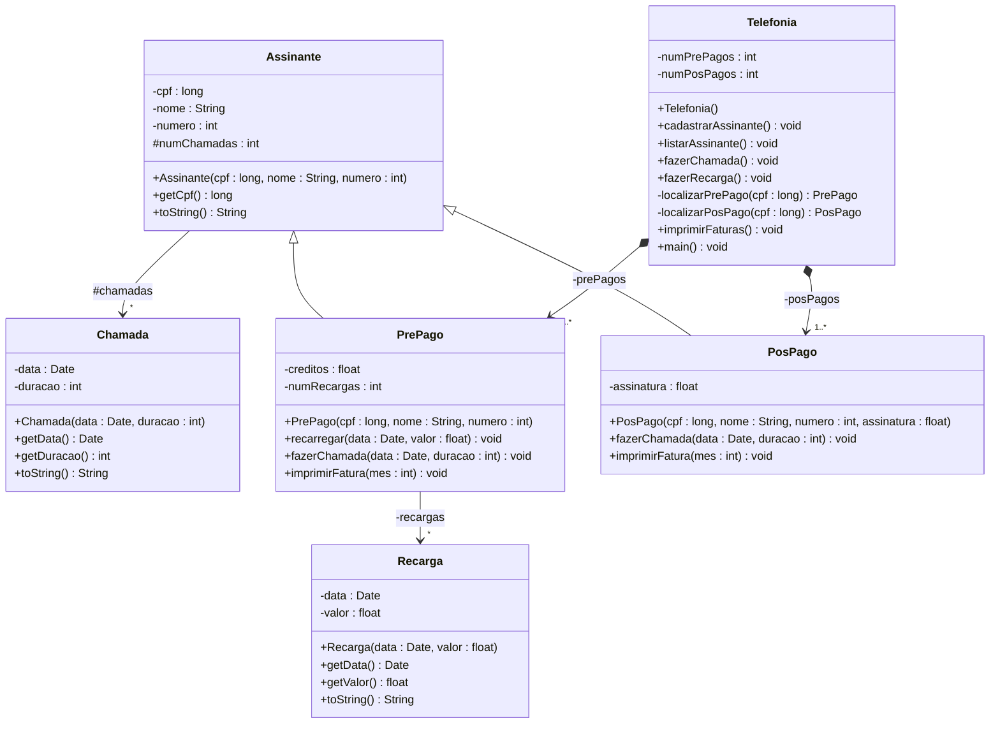

# 1º Trabalho Prático – Empresa de Telefonia Celular

## 1. Introdução
Este trabalho consiste na implementação de um sistema de cadastro de assinantes para uma empresa de telefonia celular, utilizando os conceitos de orientação a objetos. O sistema deve seguir o diagrama de classes UML fornecido abaixo.

## 2. Diagrama de Classes UML

## 3. Descrição do Sistema

O sistema deverá ser baseado em um menu com as seguintes opções:
- **Cadastrar assinante:** o sistema deverá solicitar o tipo de assinante, pré-pago ou pós-pago, e depois solicitar os dados específicos do assinante;
- **Listar assinantes:** o sistema deverá listar os dados de todos os assinantes pré-pagos e pós-pagos cadastrados; 
- **Fazer chamada:** o sistema deverá solicitar o tipo de assinante e seu CPF, depois solicitar os dados da chamada, data e duração; 
- **Fazer recarga:** o sistema deverá solicitar o CPF de um assinante pré-pago e depois solicitar a data e o valor da recarga; 
- **Imprimir faturas:** o sistema deverá solicitar o mês e imprimir todas as faturas dos assinantes pré-pagos e pós-pagos; 
- **Sair do programa:** encerra a execução do programa.

## 4. Descrição das Classes

A seguir serão descritas as classes do sistema.

### Assinante

A classe `Assinante` possui 5 atributos:
- `cpf`: CPF do assinante;
- `nome`: Nome completo do assinante;
- `numero`: Número do telefone celular do assinante;
- `chamadas`: Vetor de referências a objetos da classe `Chamada`, representando as chamadas feitas pelo assinante;
- `numChamadas`: Número de chamadas feitas pelo assinante.

O construtor desta classe deve inicializar seus atributos com os argumentos do construtor e instanciar o vetor `chamadas`.

Os métodos da classe `Assinante` são descritos a seguir:
- `long getCpf()`: Devolve o CPF do assinante;
- `String toString()`: Devolve uma representação textual dos atributos de um assinante.

### PrePago

A classe `PrePago` possui 3 atributos adicionais:
- `creditos`: Créditos do assinante;
- `recargas`: Vetor de referências a objetos da classe `Recarga`, representando as recargas de crédito feitas pelo assinante;
- `numRecargas`: Número de recargas feitas pelo assinante.

O construtor desta classe deve inicializar o CPF, nome e número do telefone do assinante, além de instanciar o vetor `recargas`.

Os métodos da classe `PrePago` são descritos a seguir:
- `void fazerChamada(Date data, int duracao)`: Registra uma chamada de um assinante pré-pago em uma data e com uma duração em minutos dadas por seus argumentos. O método deve verificar se há espaço no vetor `chamadas` e se o assinante tem créditos suficientes. O custo de uma chamada pré-paga é de R$ 1,45 por minuto. Se a chamada for bem sucedida, ela deve ser armazenada no vetor `chamadas`, o número de chamadas (`numChamadas`) e os créditos (`creditos`) devem ser atualizados; caso contrário, exibir mensagens apropriadas;
- `void recarregar(Date data, float valor)`: Registra uma recarga de um assinante pré-pago em uma data e com um valor dados por seus argumentos. O método deve verificar se há espaço no vetor `recargas`. Se houver, a recarga deve ser armazenada no vetor, e o número de recargas (`numRecargas`) e os créditos (`creditos`) devem ser atualizados; caso contrário, exibir mensagem apropriada;
- `void imprimirFatura(int mes)`: Imprime a fatura de um assinante pré-pago para um mês dado por seu argumento. O método deve imprimir os dados do assinante (CPF, nome e número do telefone), a data, duração e valor de suas chamadas feitas no mês, e a data e valor de suas recargas. Deve imprimir também o valor total de todas as ligações e recargas do mês e os créditos restantes.

### PosPago

A classe `PosPago` possui 1 atributo adicional:
- `assinatura`: Valor da assinatura do serviço pós-pago.

O construtor desta classe deve inicializar todos os seus atributos com os argumentos do construtor.

Os métodos da classe `PosPago` são descritos a seguir:
- `void fazerChamada(Date data, int duracao)`: Registra uma chamada de um assinante pós-pago em uma data e com uma duração em minutos dadas por seus argumentos. O método deve verificar se há espaço no vetor `chamadas`. Se houver, a chamada deve ser armazenada no vetor, e o número de chamadas (`numChamadas`) deve ser atualizado. O custo de uma chamada pós-paga é de R$ 1,04 por minuto. Caso contrário, exibir mensagem apropriada;
- `void imprimirFatura(int mes)`: Imprime a fatura de um assinante pós-pago para um mês dado por seu argumento. O método deve imprimir os dados do assinante (CPF, nome e número do telefone), a data, duração e valor de suas chamadas feitas no mês. Deve imprimir também o valor total da fatura, que é a soma da assinatura (`assinatura`) com o custo de todas as ligações do mês.

### Chamada

A classe `Chamada` possui 2 atributos:
- `data`: Data da realização da chamada (objeto da classe `Date`);
- `duracao`: Duração da chamada em minutos.

O construtor desta classe inicializa seus atributos com os argumentos do construtor.

Os métodos da classe `Chamada` são descritos a seguir:
- `Date getData()`: Devolve o atributo `data`;
- `int getDuracao()`: Devolve o atributo `duracao`;
- `String toString()`: Devolve uma representação textual dos atributos da classe.

### Recarga

A classe `Recarga` possui 2 atributos:
- `data`: Data da realização da recarga (objeto da classe `Date`);
- `valor`: Valor em reais da recarga.

O construtor desta classe inicializa seus atributos com os argumentos do construtor.

Os métodos da classe `Recarga` são descritos a seguir:
- `Date getData()`: Devolve o atributo `data`;
- `float getValor()`: Devolve o atributo `valor`;
- `String toString()`: Devolve uma representação textual dos atributos da classe.

### Telefonia

A classe `Telefonia` possui 4 atributos:
- `prePagos`: Vetor de referências a objetos do tipo `PrePago`, representando os assinantes pré-pagos cadastrados;
- `numPrePagos`: Quantidade de assinantes pré-pagos cadastrados;
- `posPagos`: Vetor de referências a objetos do tipo `PosPago`, representando os assinantes pós-pagos cadastrados;
- `numPosPagos`: Quantidade de assinantes pós-pagos cadastrados.

O construtor desta classe instancia os vetores `prePagos` e `posPagos`.

Os métodos da classe `Telefonia` são descritos a seguir:
- `void cadastrarAssinante()`: Solicita ao usuário os dados de um assinante pré-pago ou pós-pago e os cadastra no sistema. O método deve verificar se há espaço no vetor apropriado (`prePagos` ou `posPagos`) e armazenar os dados do assinante no vetor correspondente, atualizando os contadores (`numPrePagos` ou `numPosPagos`);
- `void listarAssinante()`: Imprime os dados de todos os assinantes cadastrados, tanto pré-pagos quanto pós-pagos. Utilize o método `toString()` de cada assinante para imprimir seus dados;
- `void fazerChamada()`: Solicita ao usuário os dados de uma chamada e a registra no sistema. O método deve solicitar o tipo de assinante (pré-pago ou pós-pago), o CPF do assinante e os dados da chamada (data e duração). Em seguida, deve localizar o assinante apropriado e registrar a chamada utilizando o método `fazerChamada()` do assinante. Caso não encontre o assinante, deve exibir uma mensagem apropriada;
- `void fazerRecarga()`: Solicita ao usuário os dados de uma recarga e a registra no sistema. O método deve solicitar o CPF de um assinante pré-pago e os dados da recarga (data e valor). Em seguida, deve localizar o assinante apropriado e registrar a recarga utilizando o método `recarregar()` do assinante. Caso não encontre o assinante, deve exibir uma mensagem apropriada;
- `void imprimirFaturas()`: Solicita ao usuário o mês e imprime as faturas de todos os assinantes cadastrados, tanto pré-pagos quanto pós-pagos. Utilize o método `imprimirFatura()` de cada assinante para imprimir suas faturas;
- `PrePago localizarPrePago(long cpf)`: Localiza e devolve um assinante pré-pago a partir do seu CPF. Caso não encontre o assinante, devolve `null`;
- `PosPago localizarPosPago(long cpf)`: Localiza e devolve um assinante pós-pago a partir do seu CPF. Caso não encontre o assinante, devolve `null`;
- `void main()`: Método principal que apresenta o menu de opções ao usuário e invoca os métodos correspondentes conforme a escolha do usuário. O menu deve permitir ao usuário realizar todas as operações descritas acima (cadastrar assinante, listar assinantes, fazer chamada, fazer recarga, imprimir faturas e sair do programa).
